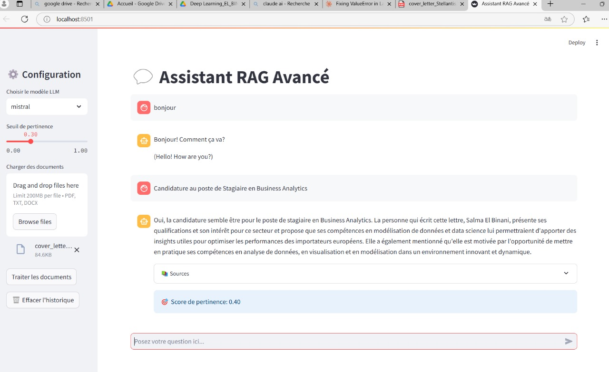
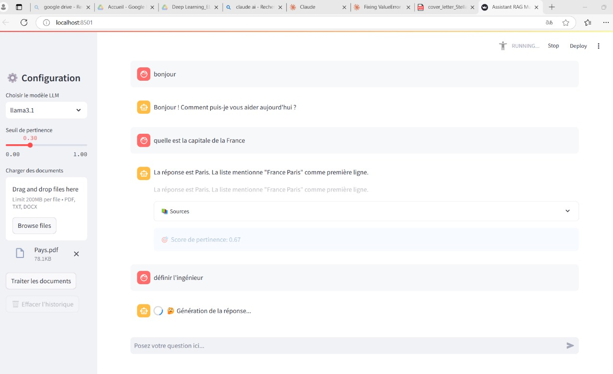
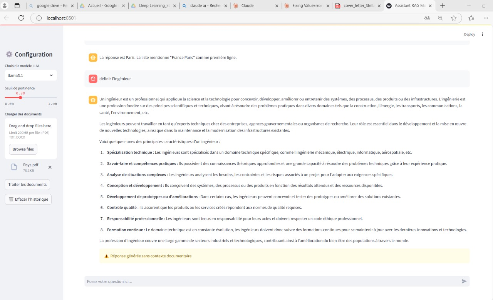

# Assistant RAG Multi-Modèles

Ce projet est une application Streamlit pour un assistant de récupération de documents (RAG) multi-modèles utilisant des modèles de langage LLM. L'application permet de charger, traiter et interroger des documents en utilisant différents modèles de langage.

## Fonctionnalités

- **Chargement de documents** : Supporte les fichiers PDF, TXT et DOCX.
- **Traitement des documents** : Utilise des loaders spécifiques pour chaque type de fichier.
- **Vectorisation des documents** : Utilise Chroma pour créer un vectorstore persistant.
- **Recherche et récupération** : Utilise des chaînes de récupération conversationnelle pour interroger les documents.
- **Interface utilisateur** : Interface intuitive avec Streamlit pour configurer et interagir avec l'assistant.

## Installation

### Prérequis

Assurez-vous d'avoir installé les éléments suivants :

- [Python 3.8+](https://www.python.org/downloads/)
- [pip](https://pip.pypa.io/en/stable/installation/)
- [Git](https://git-scm.com/)

### Étapes d'installation

1. Clonez le dépôt :
    ```bash
    git clone https://github.com/votre-utilisateur/assistant-rag-multi-modeles.git
    cd assistant-rag-multi-modeles
    ```

2. Créez un environnement virtuel (recommandé) :
    ```bash
    python -m venv env
    source env/bin/activate  # Sur Windows, utilisez `env\Scripts\activate`
    ```

3. Installez les dépendances :
    ```bash
    pip install -r requirements.txt
    ```

4. Lancez l'application Streamlit :
    ```bash
    streamlit run code_app.py
    ```

## Utilisation

1. Lancez l'application Streamlit :
    ```bash
    streamlit run code_app.py
    ```

2. Configurez l'assistant via la barre latérale :
    - Choisissez le modèle LLM.
    - Réglez le seuil de pertinence.
    - Chargez les documents à traiter.

3. Posez vos questions dans la zone de saisie et obtenez des réponses pertinentes basées sur les documents chargés.

## Configuration

- **Modèles supportés** : `llama3.1`, `mistral`, `llama3.2`, `gemma:7b`, `llama2:13b`
- **Seuil de pertinence** : Ajustable via un slider dans l'interface.


## Interface Utilisateur

Voici quelques captures d'écran pour illustrer le fonctionnement de l'application :






## Contribuer

Les contributions sont les bienvenues ! Veuillez soumettre une pull request ou ouvrir une issue pour discuter des changements que vous souhaitez apporter.

## Licence

Ce projet est sous licence MIT. Voir le fichier [LICENSE](LICENSE) pour plus de détails.
